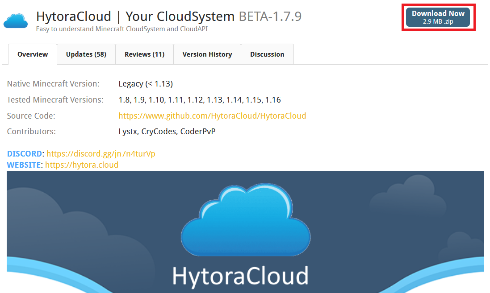
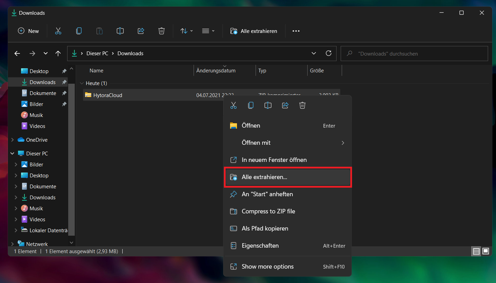
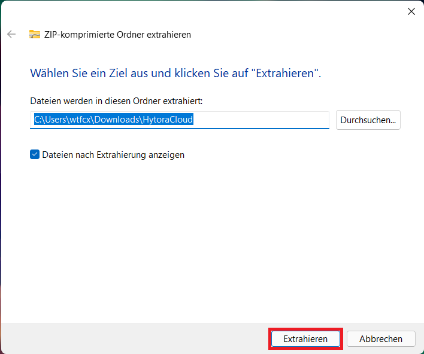

# ☁️ Installing HytoraCloud

### Downloading HytoraCloud

In order to start the installation process, you have to download HytoraCloud from SpigotMC. Navigate to [https://www.spigotmc.org/resources/hytoracloud-your-cloudsystem.88159/](https://www.spigotmc.org/resources/hytoracloud-your-cloudsystem.88159/) in your browser and download the newest release. \(Click the "Download Now" Button\)



### Connecting to your server

Now, you have to connect to your server using SFTP. If you do not know how to do that, please don't make a server in the first place. If you do not have a server, and you are running it on your PC, then you don't have to do that.

### Extracting contents of the archive

Now extract the `HytoraCloud.zip` you just downloaded, by right-clicking on it and choosing "Extract All" in the context-menu.



Now in the window that opened, click "Extract" again.



### Uploading files

Now that you've done that, you can either leave it there if you're not uploading it, or upload it to your server. We'd recommend you putting it in the home folder. `/home/HytoraCloud/<files>`

### Setting up HytoraCloud

After you've uploaded the files, we can finally start installing HytoraCloud. Connect to your server, and `cd` into the folder.

```text
$ cd /home/HytoraCloud/
```

#### Start file

#### Linux-based systems

If you're on linux \(which you most likely are\), there is a high chance of you having to make the `start.sh` file executable. In order to do that, run the following command:

```text
$ chmod +x start.sh
```

Now we can finally jump right in! Type `./start.sh` in order to start the cloud.

#### Windows-based systems

Nothing else needed, just double-click the `start.bat` file and it should start right up!

If we did everything correctly, you should now be able to see that it's downloading Libraries - and after that, it should show you the setup.


Type `1` in order to use the `CloudSystem` and not the `Receiver`.


Type `localhost` if you don't want to use `Multi-Root`.


We'd recommend you choosing `1521` as the port here.


Here... _you guessed it..._ you have to type the maximum amount of players online at the same time. 


Here you have to type the name of your minecraft account. \(eg. `cxt`\)


You are granting this account all permissions. Choose wisely!



Choose `false` for now, we will notify you when this finally works.


Choose `false` if you don't want to use ProxyProtocol or don't even know what that is.


Choose `Files` because a different database solution is not necessary for most users.


We'd recommend you choosing `BUNGEECORD` as the proxy software, otherwise choose whatever you want.



1.17.x versions won't work.


HytoraCloud will now start downloading Spigot & BungeeCord \(or the proxy you've chosen\). After that the setup is finished! Now start the cloud again using the `start.sh` file and you're good to go!

### We're finished! \(hopefully\)

Your console output should look something like this:


_If it does:_  
**Congratulations!** You have succesfully installed HytoraCloud on your server.

_If it doesnt:_  
Hm... that's weird. Please check out the [Troubleshooting](../post-install/troubleshooting.md)[ guide](../post-install/troubleshooting.md) or [join the discord](https://discord.gg/85mfsFXSyV) for support.  


