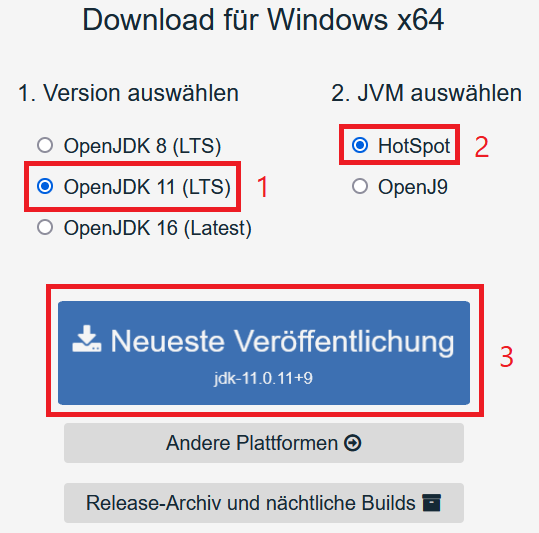
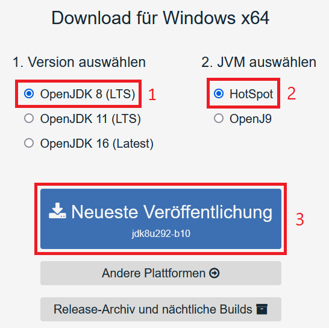

# ☕ Installing Java

If you haven't installed Java already, you have to install it in order to use it with HytoraCloud.

### Installation of Java

This works on both windows and linux.



#### Debian/Ubuntu

In order to install Java 11 on Debian you have to run the following command:

```text
$ sudo apt install openjdk-11-jre-headless
```

Now you can check if it's installed correctly by running:

```text
$ java -version
openjdk version "11.0_XXX"
OpenJDK Runtime Environment (build 11.0_XXXXXXXXXXXX)
OpenJDK 64-Bit Server VM (build XXXXX, mixed mode)
```

#### Windows

In order to install Java 11 on Windows, please visit [https://adoptopenjdk.net/](https://adoptopenjdk.net/) in your browser.



Click on "OpenJDK 11 \(LTS\)", then click on "HotSpot" and click on the Download-Button for "Newest Release".

Now open the file you have downloaded, click "Next", agree to the license, click "Next" again and now click on "Install". After that finished, you have successfully installed Java 11 on your windows machine.




We do not recommend using Java 8 because it is literally 6 years old \(March 18, 2014\)


#### Debian/Ubuntu

In order to install Java 8 on Debian you have to run the following command:

```text
$ sudo apt install openjdk-8-jre-headless
```

Now you can check if it's installed correctly by running:

```text
$ java -version
openjdk version "1.8.0_XXX"
OpenJDK Runtime Environment (build 1.8.0_XXXXXXXXXXXX)
OpenJDK 64-Bit Server VM (build XXXXX, mixed mode)
```

#### Windows

In order to install Java 8 on Windows, please visit [https://adoptopenjdk.net/](https://adoptopenjdk.net/) in your browser.



Click on "OpenJDK 8 \(LTS\)", then click on "HotSpot" and click on the Download-Button for "Newest Release".

Now open the file you have downloaded, click "Next", agree to the license, click "Next" again and now click on "Install". After that finished, you have successfully installed Java 8 on your windows machine.



Now you can continue with installing HytoraCloud itself.


