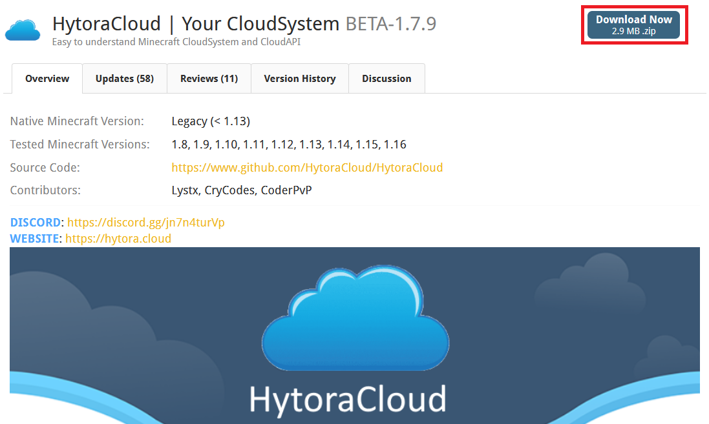
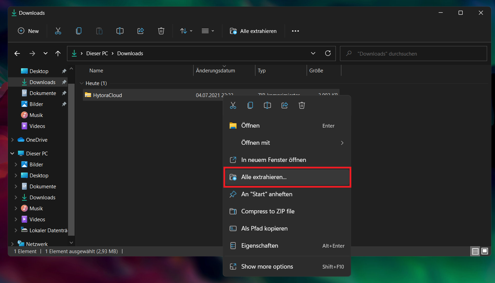

# ☁️ Installation von HytoraCloud

### HytoraCloud herunterladen

Um HytoraCloud überhaupt auf deinem Server zu installieren, musst du HytoraCloud erstmal herunterladen. Gehe mit deinem Webbrowser auf [https://www.spigotmc.org/resources/hytoracloud-your-cloudsystem.88159/](https://www.spigotmc.org/resources/hytoracloud-your-cloudsystem.88159/) und lade die neuste Version herunter. \(Klicke auf den "Download Now" Button\)



### Verbindung zu deinem Server aufbauen

Nun, musst du dich auf deinen Server per SFTP aufschalten. Falls du nicht weißt wie man das macht, ist dieses Guide \(und HytoraCloud\) höchstwahrscheinlich nichts für dich. Wenn du HytoraCloud natürlich auf deinem PC ausführst um es z.B. zu testen dann ist dieser Schritt nicht notwendig.

### Inhalt des Archives entpacken

Nun kannst du die `HytoraCloud.zip` welche du gerade heruntergeladen hast, entpacken. Um dies zu tun, musst du einen Rechtsklick auf die Datei machen und `Alle extrahieren...` auswählen.



In dem Fenster welches sich gerade geöffnet hat, musst du nun erneut auf "Extrahieren" klicken.


### Dateien hochladen

Da du nun die Dateien entpackt hast, musst du sie entweder auf deinem Server hochladen, oder wenn du HytoraCloud auf deinem PC ausführst sie einfach drauf lassen. Wenn du nicht weißt wie das geht, benutze HytoraCloud bitte nicht. Wir empfehlen dir den Ordner `/home/HytoraCloud/<files>`

### HytoraCloud einrichten

Da du nun die Dateien hochgeladen hast \(oder auf deinem PC gelassen hast\), können wir jetzt endlich HytoraCloud auf deinem Server einrichten. Verbinde dich mit deinem Server und `cd` deinen Weg in den Ordner.

```text
$ cd /home/HytoraCloud/
```

#### Startdatei

#### Linux Systeme

Falls du Linux verwendest \(was sehr wahrscheinlich ist\), dann musst du auch höchstwahrscheinlich die Startdatei ausführbar machen.

```text
$ chmod +x start.sh
```

Nun kannst du die Cloud direkt starten! Tippe einfach `./start.sh` in dein Terminal ein und HytoraCloud sollte starten.

#### Windows Systeme

Hier sollte eigentlich keine Vorbereitung nötig sein.

Falls wir alles richtig gemacht haben, solltest du nun sehen dass HytoraCloud Libraries \(Bibliotheken\) runterlädt. Dieser Prozess kann einen Moment dauern. Danach, solltest du auch direkt das Setup sehen.


Wähle `1` weil wir das `CloudSystem` und nicht den `Receiver` verwenden wollen.


Wähle hier `localhost` da du höchstwahrscheinlich kein `Multi-Root` benutzen willst. Falls ja, gib die IP von deinem Server ein.


Wir empfehlen dir hier den Port `1521`.


Hier... _du hast es erraten..._ must du die Anzahl der Spieler eintragen, welche maximal gleichzeitig auf dem Server sein können.


Hier musst du den Namen der ersten Admins eintragen. \(z.B. `cxt`\)


Dieser Account wird alle Rechte auf deinem Server haben!



Wähle hier `false`, ansonsten wirst du es später bereuen.


Wähle hier `false` wenn du `ProxyProtocol` nicht verwenden willst oder nicht mal weißt was das ist.


Wähle hier `Files`, eine andere Datenbank ist normalerweise unnötig für die meisten Benutzer.


Wir empfehlen als Proxy Software `BUNGEECORD`, ansonsten kannst du auch eine beliebige andere auswählen.


Wähle hier die Spigot Version aus, welche deine Unterserver benutzen sollen.


1.17.x Versionen werden nicht funktionieren.


HytoraCloud wird nun Spigot & deine Proxy-Software für dich herunterladen. Danach sind wir fertig! Du kannst nun die Cloud mit der `start.sh` starten und kannst HytoraCloud verwenden

### Wir sind fertig! \(hoffentlich, oder?\)

Nach dem Neustart, sollte die Konsole in etwa so aussehen:


_Wenn sie so aussieht:_  
**Herzlichen Glückwunsch!** Du hast erfolgreich HytoraCloud installiert!

_Falls nicht:_  
Hm... das is blöd. Vielleicht findest du ja Hilfe im Troubleshooting Guide, ansonsten kannst du auch mal auf unserem Discord Server nach Hilfe fragen.

