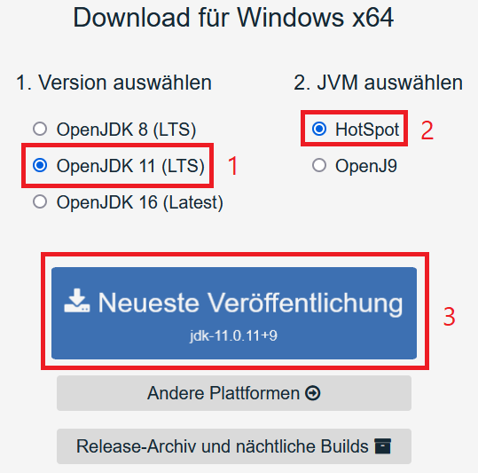

# ☕ Installation von Java

Falls du Java nicht bereits installiert haben solltest, musst du es mithilfe dieser Anleitung installieren da HytoraCloud auf Java basiert.

### Installation von Java

Dies funktioniert auf Windows und sowohl Linux.





#### Debian/Ubuntu

Um Java 11 auf deinem Server zu installieren, gib den folgenden Befehl in deinem Terminal ein:

```text
$ sudo apt install openjdk-11-jre-headless
```

Wenn du überprüfen möchtest, ob Java korrekt installiert wurde, kannst du diesen Befehl verwenden:

```text
$ java -version
openjdk version "11.0_XXX"
OpenJDK Runtime Environment (build 11.0_XXXXXXXXXXXX)
OpenJDK 64-Bit Server VM (build XXXXX, mixed mode)
```

Die Ausgabe sollte so ähnlich aussehen wie in diesem Codeblock.

#### Windows

Um Java 11 auf deinem PC bzw. auf einem Windows Server zu installieren, besuche erstmal [https://adoptopenjdk.net/](https://adoptopenjdk.net) in deinem Browser.



Nun, musst du auf "OpenJDK 11 \(LTS\)" klicken, danach musst du "HotSpot" als JVM auswählen; jetzt musst du nur noch auf den großen blauen Button drücken um den neusten Release von Java 11 herunterzuladen.

Öffne den Installer welchen du gerade heruntergeladen hast, klicke auf "Weiter", stimme der Lizenzvereinbarung zu, klicke dann wieder auf "Weiter" und auf "Installieren". Wenn dieser Vorgang \(hoffentlich erfolgreich\) abgeschlossen ist, hast du erfolgreich Java 11 auf deinem Server/PC installiert. 



#### 

#### Debian/Ubuntu

Um Java 8 auf deinem Server zu installieren, gib den folgenden Befehl in deinem Terminal ein:

```text
$ sudo apt install openjdk-8-jre-headless
```

Wenn du überprüfen möchtest, ob Java korrekt installiert wurde, kannst du diesen Befehl verwenden:

```text
$ java -version
openjdk version "1.8.0_XXX"
OpenJDK Runtime Environment (build 1.8.0_XXXXXXXXXXXX)
OpenJDK 64-Bit Server VM (build XXXXX, mixed mode)
```

Die Ausgabe sollte so ähnlich aussehen wie in diesem Codeblock.

#### Windows

Um Java 8 auf deinem PC bzw. auf einem Windows Server zu installieren, besuche erstmal [https://adoptopenjdk.net/](https://adoptopenjdk.net) in deinem Browser.


Nun, musst du auf "OpenJDK 8 \(LTS\)" klicken, danach musst du "HotSpot" als JVM auswählen; jetzt musst du nur noch auf den großen blauen Button drücken um den neusten Release von Java 8 herunterzuladen.

Öffne den Installer welchen du gerade heruntergeladen hast, klicke auf "Weiter", stimme der Lizenzvereinbarung zu, klicke dann wieder auf "Weiter" und auf "Installieren". Wenn dieser Vorgang \(hoffentlich erfolgreich\) abgeschlossen ist, hast du erfolgreich Java 8 auf deinem Server/PC installiert. 



Jetzt kannst du mit der Installation von HytoraCloud beginnen.

